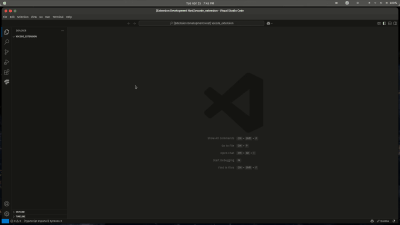

# API Project Generator 💡


<p align="center">

</p>

The **API Project Generator** is a Visual Studio Code extension designed to streamline the creation of API projects by automating folder structure setup, file generation, and package management. It provides a user-friendly interface for quickly generating a boilerplate for APIs, offering options for various levels of complexity: Simple, Advanced, and Complex.

## VS Code Marketplace Url

[API Folder Generator](https://marketplace.visualstudio.com/items?itemName=AmireJoseph.api-folder-gen)

## How to call API Folder Generator

```
ctrl + shift + p
```

## Features

### Folder Structure Customization

-   Automatically creates essential folders such as controllers, routes, config, middlewares, models, services, and more, based on the selected complexity.
-   **Predefined folder structures**:
    -   **Simple**: Minimal structure with controllers and routes.
    -   **Advanced**: Includes additional folders like config, middlewares, models, and utils.
    -   **Complex**: Adds services and tests folders for a comprehensive project organization.

### File Generation

-   Automatically generates a `server.js` or `server.ts` file in your preferred language (JavaScript or TypeScript).
-   Prepopulated boilerplate code for the server file to kickstart your project.

### Integration with npm

-   Automatically initializes a `package.json` file with scripts for starting and developing the API.
-   Option to install necessary npm packages, such as Express, directly from the interface.

### Customizable Extensions

-   Supports both JavaScript and TypeScript, allowing users to select their preferred development environment.

### Interactive Workflow

-   Utilizes VS Code’s Quick Pick menus for an intuitive and guided setup process.
-   Offers flexibility to choose automation or manual configuration for certain steps, such as npm initialization.

### Ease of Use

-   Automatically updates `package.json` with relevant fields and scripts.
-   Prompts for optional installation of key dependencies to kickstart development.

## Requirements

### 1. Environment

-   **VS Code**: The extension runs inside Visual Studio Code.
-   **Node.js**: Required to run npm commands for creating files and dependencies.

### 2. User Input

-   **API Complexity**: Choose one:
    -   **Simple**: Basic folders like controllers and routes.
    -   **Advanced**: Adds more folders like config, models, and middlewares.
    -   **Complex**: Includes everything from the Advanced option, plus services and tests.
-   **Programming Language**: Choose between JavaScript or TypeScript.
-   **NPM Initialization**: Decide whether to auto-generate `package.json` or do it manually.
-   **Install Packages**: Choose whether to automatically install dependencies like Express.

### 3. Files and Folders Created

Based on the selected API complexity, different folders and files will be created, such as:

-   **Simple Setup**: `controllers`, `routes`, `server.js/server.ts`.
-   **Advanced and Complex Setups**: Adds folders like `config`, `models`, `middlewares`, `services`, and `tests`.

### 4. Permissions

-   **Read/Write Access**: Required to create files and folders in the project.

### 5. Dependencies

-   **VS Code API**: To interact with the VS Code environment.
-   **Node.js Modules**: For file handling (fs), path resolution (path), and running npm commands (child_process).

### 6. Error Handling

-   **Missing Folder**: If no workspace is open, an error message is displayed.
-   **File Creation Errors**: Handles and shows errors if something goes wrong during file or folder creation.

### 7. Feedback to User

-   **Confirmation**: Users are notified when the process is complete.
-   **Error Messages**: Show warnings for any issues that arise during setup.

## Extension Settings

-   **Node.js Required**: Ensure Node.js is installed to run npm commands for package management.
-   **Nodemon Required**: Ensure Nodemon is installed to facilitate development.

## Known Issues

-   **Node.js Required**: Ensure Node.js is installed to run npm commands for package management.
-   **Nodemon Required**: Ensure Nodemon is installed to facilitate development.

## Release Notes

### 1.0.0

**Release Date**: December 17, 2024

**New Features**:

-   **API Project Generator**:

    -   Generate an API project structure with varying levels of complexity: Simple, Advanced, and Complex.
    -   **Simple**: Basic structure with controllers and routes.
    -   **Advanced**: Adds folders for config, middlewares, models, and utils.
    -   **Complex**: Includes services and tests.

-   **Flexible Language Choice**:

    -   Choose between JavaScript or TypeScript for your project files (`server.js/server.ts`).

-   **Automatic `package.json` Generation**:

    -   Option to automatically generate a `package.json` file with basic scripts for starting and developing the API.

-   **Install Essential Packages**:

    -   Automatically installs important npm packages like Express, if selected by the user.

-   **VS Code Integration**:
    -   Seamless integration with VS Code for easy creation of folders, files, and project setup.

**Improvements**:

-   **Simplified Setup**:

    -   User-friendly prompts to guide users through selecting their preferred API structure, language, and package setup.

-   **Error Handling**:

    -   Improved error messages for workspace or folder issues.

-   **Clear Feedback**:
    -   Detailed messages showing the success of folder and file creation, as well as npm command executions.

**Bug Fixes**:

-   Fixed potential issues with folder creation if no workspace is open.
-   Improved handling of invalid or missing file paths during project generation.

### 1.1.0

-   **Coming Soon**: AI-powered features for auto-generating complex API structures based on project requirements and AI-guided code suggestions.

---

## Upcoming AI Features

We are excited to announce the upcoming integration of **AI-powered features** to enhance your API development process:

**Python API folder generator** option to choose either the api folder you want to generate is for nodejs or for python

**Support for other API package and libraries** support for other API libraries and packages :

| Node.js API Libraries | Python API Libraries |
| --------------------- | -------------------- |
| Express.js            | FastAPI              |
| Koa.js                | Flask                |
| Restify               | Falcon               |
| Polka                 | Sanic                |
| Micro                 | Hug                  |
| Fastify               | Bottle               |

<!-- -   **Automated Testing**: Automatically generate unit tests and integration tests for your API endpoints based on the project structure. AI will suggest optimal testing strategies to ensure your API is robust and error-free.

-   **Smart Code Suggestions**: The extension will offer intelligent code completion and suggestions tailored to your project's needs. Whether it's adding middleware or optimizing routes, AI will assist in writing high-quality, efficient code.

These features will be available soon and will further automate and streamline the development process, providing even more value to your workflow. -->

---

## For Support and Contact

-   **Email**: amirejoseph83@gmail.com
-   **USDT BNB (Binance Smart Chain)**: `0x52620572bc56AE24a7Ea0403Cf66989091714957`

---

**Enjoy!**
